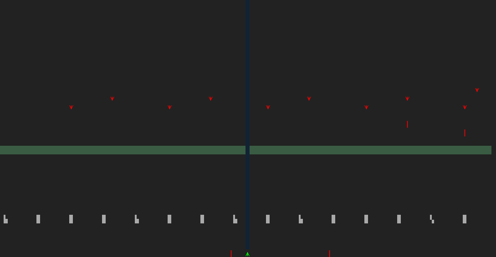

# Console Invaders

## Description

A quickly thrown together concept of a console-based game, heavily inspired by the classic arcade game [Space Invaders](https://en.wikipedia.org/wiki/Space_Invaders).

This is the result of a solo "game jam"-esque challenge I set myself, to see how far I could get in a day (roughly eight hours from start to finish). The aim was to make a simple but functional console-based game in roughly the equivalent of a working day.

## Requirements:

- Windows 10 Insiders Build #14931 or newer, in order to support [24-bit colors in the console](https://devblogs.microsoft.com/commandline/24-bit-color-in-the-windows-console/) (developed on Windows 11 version 21H2).
- Windows Terminal (this project was developed for, and "balanced" around, a console window with dimensions of 156x42, developed for Windows Terminal version 1.11.2921.0).
- .NET 6 runtime and SDK.

## Gameplay:

- Use the left and right arrow keys to move to the sides.
- Use the up arrow key to shoot.
- Hide behind barriers (they can withstand four hits before breaking).
- If the invaders make it to the horizontal green line, you lose.
- If you die (take three hits), you lose.
- If you manage to shoot all the invaders before they reach the green line, you win.

## Features

- Efficient console text writing, using P/Invoke to leverage `kernel32.dll`'s [`WriteConsole`](https://docs.microsoft.com/en-us/windows/console/writeconsole) function.
- Full 24-bit color support, utilizing [ANSI escape sequences](https://en.wikipedia.org/wiki/ANSI_escape_code#24-bit).
- Very basic animations. Used when an invader is shot.

## Known issues

Due to the brief nature of this project, the quality standard to be met were simply to run adequetly on the machine it was developed on. This meant intentionally letting certain known issues remain in the code, as they did not dramatically decrease the performance or experience on the development machine.

- The codebase is messy, and lacks documentation.
- The `Game` class has way too many responsibilities.
- Improper string usage, resulting in aggressive garbage collection.
- Poor performance when using ConHost on older systems.
- Suboptimal usage of thread safe code.
- The `ConsoleChar` union struct has two unused bytes, specifically the last byte in the `foreground` and `background` fields.
- Resizing or zooming the console window breaks rendering, as the game's grid does not adjust after startup.
- Support for ConHost (the old Windows console host) was an afterthought. Some of the characters used as sprites do not render properly in ConHost, and performance can be rather poor on older hardware.
- Only runs on Windows.

## License

[MIT license.](./LICENSE)
